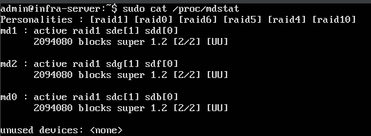
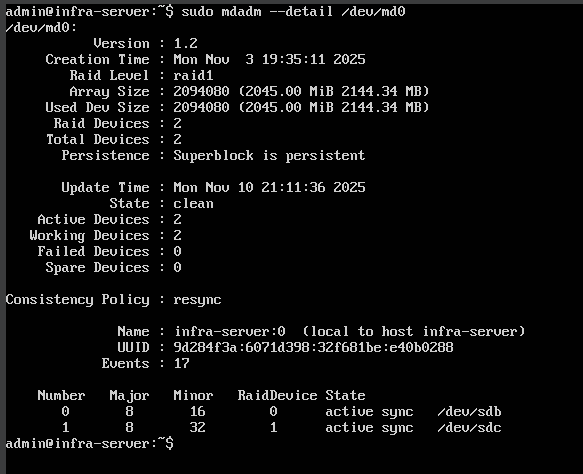
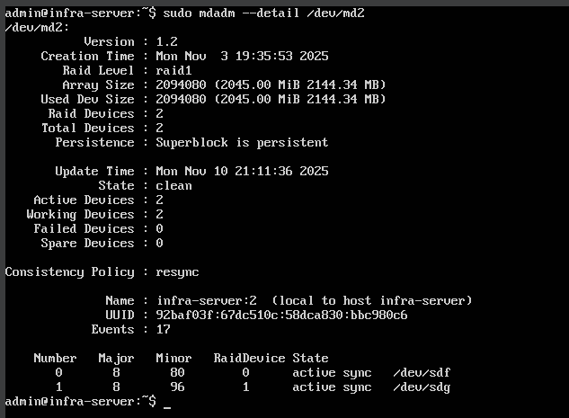
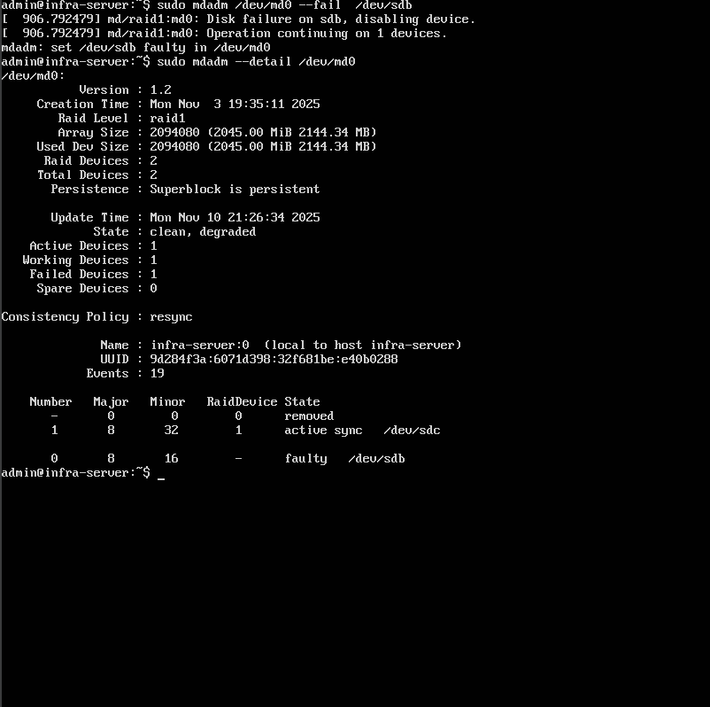
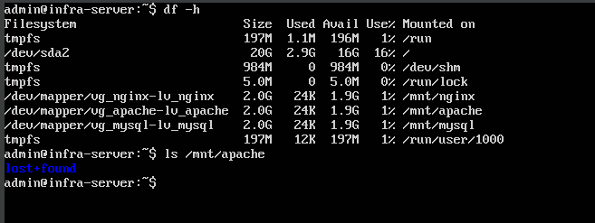
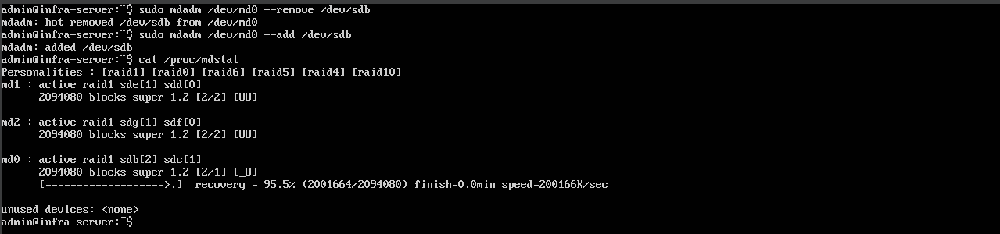
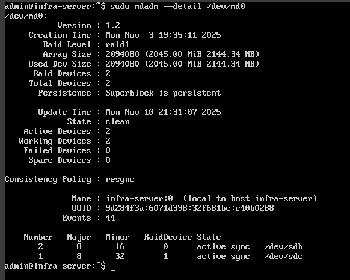

# Bitácora 4 – Pruebas de los Arreglos RAID y Verificación de Redundancia

## 1. Objetivo

El objetivo de esta cuarta etapa del proyecto es realizar pruebas sobre los **arreglos RAID 1** configurados previamente, con el fin de comprobar su **funcionalidad, redundancia y tolerancia a fallos**, con el fin de validar que la infraestructura desarrollada responde correctamente ante la pérdida o fallo de uno de los discos, asegurando la disponibilidad de los datos. 

---

## 2. Verificación inicial del estado de los arreglos RAID

Antes de iniciar las pruebas de falla, se verificó que los tres arreglos RAID creados en la práctica anterior estuvieran **en estado activo y sincronizado**.  

Para ello, se emplearon los siguientes comandos:

- cat /proc/mdstat
- sudo mdadm --detail /dev/md0
- sudo mdadm --detail /dev/md1
- sudo mdadm --detail /dev/md2

Estos comandos permiten visualizar el estado de sincronización, los discos activos y el número de dispositivos en cada arreglo.

El resultado obtenido fueron los tres arreglos con el estado:

- State : clean
- Active Devices : 2
- Working Devices : 2

**Evidencias:**
- *Figura 1.* Estado inicial de los tres arreglos RAID - `estado_inicial_raids.png`
   
- *Figura 2.* Estado inicial RAID md0 - `estado_inicial_md0.png`
  
- *Figura 3.* Estado inicial RAID md1 - `estado_inicial_md1.png`
  
- *Figura 4.* Estado inicial RAID md2 - `estado_inicial_md2.png`
  

---

## 3. Simulación de una falla en un disco del RAID

Para comprobar la tolerancia a fallos, se procedió a simular la falla de un disco dentro del primer arreglo (/dev/md0), utilizando el siguiente comando:

- sudo mdadm /dev/md0 --fail /dev/sdb

Con este comando se marca el disco /dev/sdb como defectuoso.

Luego se verifico el nuevo estado del arreglo:

- sudo mdadm --detail /dev/md0

El resultado es un estado “degraded”, indicando que el arreglo perdió uno de sus discos pero sigue funcionando gracias al espejo restante (/dev/sdc).

**Evidencia:**
- *Figura 5.* Simulación de falla del disco /dev/sdb en el arreglo RAID 1 - `falla_disco.png`
  

---

## 4. Verificación del funcionamiento en modo degradado

Durante el estado degradado, el sistema debe seguir operativo y los datos deben permanecer accesibles.

Para comprobarlo, se listaron los volúmenes montados y se verificó que los directorios del LVM (por ejemplo /mnt/apache) continuaran accesibles:

- df -h
- ls /mnt/apache

El correcto acceso confirma que el RAID mantiene la disponibilidad de la información, incluso ante la falla de un disco.

**Evidencia:**
- *Figura 6.* Acceso a los datos mientras el RAID opera en modo degradado - `modo_degradado.png`
  

---

## 5. Recuperación del arreglo RAID

Una vez verificada la redundancia, se procedió a recuperar el arreglo RAID reemplazando el disco defectuoso.

Para esto, primero se eliminó el disco fallado del arreglo y luego se volvió a añadir:

- sudo mdadm /dev/md0 --remove /dev/sdb
- sudo mdadm /dev/md0 --add /dev/sdb

El sistema inicia automáticamente el proceso de reconstrucción, copiando nuevamente los datos al disco recién añadido.

El progreso de la sincronización puede observarse con:

- cat /proc/mdstat

Durante este proceso aparecio una barra de avance y el porcentaje completado de la sincronización.

**Evidencia:**
- *Figura 7.* Proceso de reconstrucción del arreglo RAID - `reconstruccion_raid.png`
  

---

## 6. Verificación final del estado del RAID

Una vez finalizada la sincronización, se verificó nuevamente el estado del arreglo con:

- sudo mdadm --detail /dev/md0 

El resultado fue que el RAID volvio al estado:

- State : clean
- Active Devices : 2
- Working Devices : 2

Lo que confirma que el disco fue reintegrado exitosamente y el sistema ha recuperado la redundancia.

**Evidencia:**
- *Figura 8.* Estado final del RAID luego de la recuperación - `estado_final_md0.png`
  

## Conclusion
Las pruebas realizadas permitieron demostrar de manera práctica el correcto funcionamiento de los arreglos RAID 1, confirmando su capacidad para mantener la disponibilidad y seguridad de los datos ante la falla de uno de los discos.
El sistema operó en modo degradado sin pérdida de información, y tras la reintegración del disco defectuoso, la sincronización se completó con éxito, restaurando el estado limpio del arreglo.

Con estas pruebas, se valida que la infraestructura configurada cumple con los objetivos de redundancia y tolerancia a fallos, fundamentales en entornos de servidores y sistemas de producción.