# Bitácora 5 — Implementación del servicio Apache con Docker y Bind Mount

## 1. Objetivo

El objetivo de esta etapa es desplegar un contenedor Docker con el servicio **Apache HTTP Server**, garantizando **persistencia de datos** mediante un **bind mount** enlazado directamente al **RAID 1** configurado para Apache y su correspondiente volumen **LVM**.  

---

## 2. Instalación de Docker

Para ejecutar contenedores, fue necesario instalar **Docker Engine** en el servidor Ubuntu.  

Con el fin de garantizar una versión actualizada y estable, se utilizó el **método oficial recomendado por Docker Inc.**, el cual descarga y ejecuta un script automatizado desde los repositorios oficiales.

Los comandos ejecutados fueron los siguientes:

- sudo apt update
- sudo apt install curl -y
- sudo curl -fsSL https://get.docker.com -o get-docker.sh
- sudo sh get-docker.sh

Donde:
 - *sudo apt update* **Actualiza la lista de paquetes disponibles en los repositorios del sistema.**
 - *sudo apt install curl -y* **Instala la herramienta curl, necesaria para descargar archivos desde Internet.**
 - *sudo curl -fsSL https://get.docker.com -o get-docker.sh* **Descarga el script oficial de instalación de Docker desde el sitio get.docker.com y lo guarda como get-docker.sh.**
 - *sudo sh get-docker.sh* **Ejecuta el script, el cual agrega los repositorios oficiales, instala Docker Engine, CLI y containerd, y habilita el servicio automáticamente.**

Al finalizar la instalación, se verificó la versión con:

- docker --version
- docker compose version

Además se comprobo que el servicio Docker se encontraba activo:

- sudo systemctl status docker

El estado mostrado fue “active (running)”, confirmando que Docker estaba correctamente instalado y listo para usarse.

**Evidencias:**
- *Figura 1.* Actualizacion repositorios del sistema. – `actualizacion_sistema.png`
  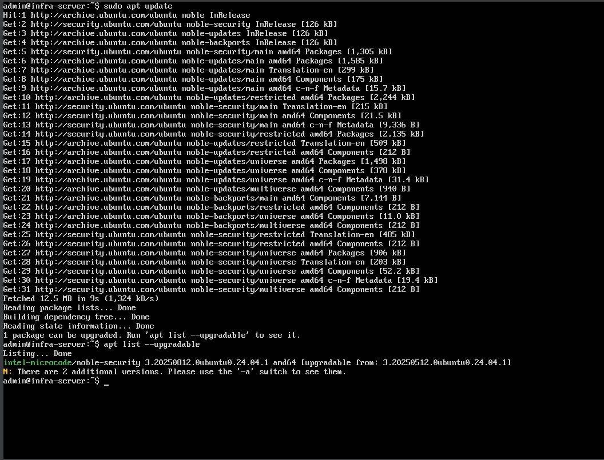
- *Figura 2.* Instalacion de la herramienta curl. – `instalacion_curl.png`
  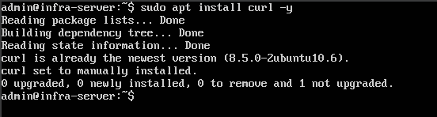
- *Figura 3.* Descarga y ejecucion de el script oficial de instalación de Docker. – `curl_docker_inicio_instalacion.png`
  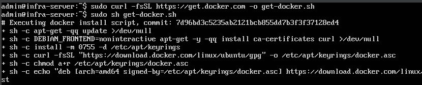
- *Figura 4.* Instalación exitosa de Docker. – `instalacion_exitosa.png`
  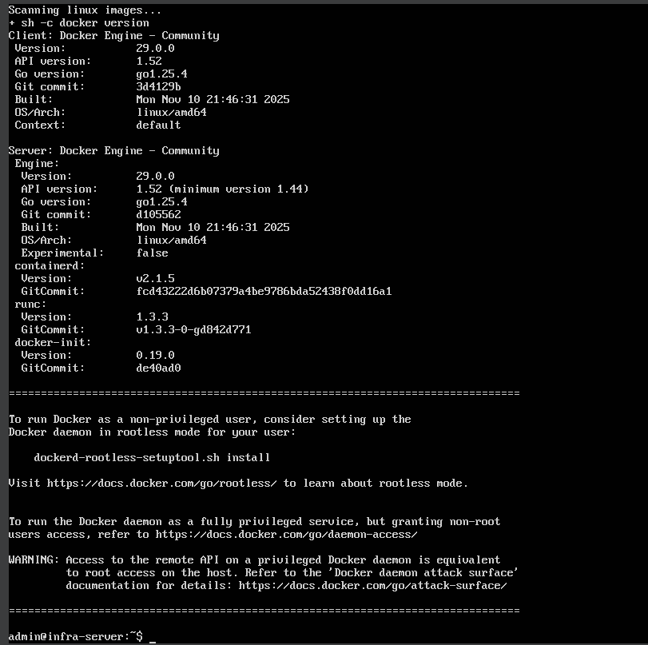
- *Figura 5.* Verificacion de la versión de docker. – `version_docker.png`
  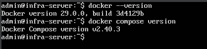
- *Figura 6.* Comprobacion servicio activo. – `estado_docker.png`
  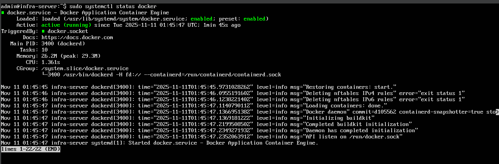

---

## 3. Preparación del entorno de almacenamiento

Antes de desplegar el contenedor, se verificó que el volumen lógico del servicio Apache estuviera correctamente montado con el comando:

- lsblk

Confirmando que el RAID 1 correspondiente (/dev/md0) y el LVM están operativos y listos para ser utilizados como punto de montaje para el contenedor.

Dentro de la ruta /mnt/apache, se creó un directorio que funcionará como raíz del sitio web y dado que esta ruta pertenece al volumen lógico sobre el RAID 1 de Apache (/dev/md0), cualquier archivo que se almacene allí contará con redundancia automática y persistencia física, los comandos utilizados fueron:

- sudo mkdir -p /mnt/apache/html
- sudo chmod -R 777 /mnt/apache/html

Tambien se le otorgo permisos 777, para garatizar que Docker pueda escribir directamente dentro del almacenamiento redundante.

Por ultimo, verificamos el punto de montaje:

- df -h | grep apache

confirmando que /mnt/apache está correctamente montado y operativo sobre la infraestructura RAID + LVM.

**Evidencias:**
- *Figura 7.* Comprobacion RAID. – `comprobacion_RAID.png`
  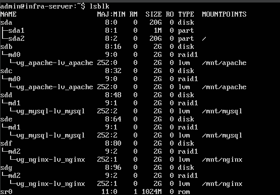
- *Figura 8.* Creacion de directorio y asignacion de permisos. – `directorio_y_permisos.png`
  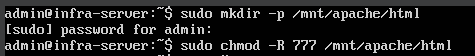
- *Figura 9.* Verificacion punto de montaje. – `verificacion_punto_montaje.png`
  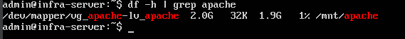

--- 

## 4. Creación del archivo de prueba HTML

Antes de desplegar el contenedor, se creó una página HTML simple en el directorio del host, que será servida por el contenedor de Apache. 

Para ello se usó el comando tee, que permite escribir archivos con privilegios de administrador:

- echo "< h1 >Servidor Apache en RAID con persistencia de datos< /h1 >" | sudo tee /mnt/apache/html/index.html

El resultado fue el archivo:

- /mnt/apache/html/index.html

El cual contiene el texto HTML creado anteriormente, confirmando la correcta preparación del entorno web.

**Evidencia:**
- *Figura 10.* Creacion pagina html simple. – `creacion_pagina_html.png`
  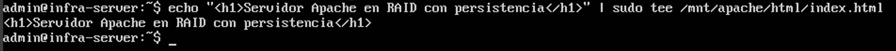

--- 

## 5. Creación y ejecución del contenedor Apache

Una vez instalado Docker y preparado el entorno de almacenamiento, se procedió a crear el contenedor del servicio web Apache con persistencia sobre el RAID.

Para ello se ejecutó el siguiente comando:

sudo docker run -d --name apache_bind -p 8080:80 -v /mnt/apache/html:/usr/local/apache2/htdocs httpd:2.4

Donde:
- *docker run* **Crea y ejecuta un nuevo contenedor.**
- *-d* **Ejecuta el contenedor en segundo plano (modo detached).**
- *--name apache_bind* **Asigna un nombre identificador al contenedor.**
- *-p 8080:80* **Asocia el puerto 8080 del host con el 80 del contenedor, permitiendo acceso vía navegador.**
- *-v /mnt/apache/html:/usr/local/apache2/htdocs* **Define un bind mount: enlaza el directorio físico del host (RAID 1) con el directorio interno donde Apache aloja su contenido web.**
- *httpd:2.4* **Especifica la imagen oficial de Apache versión 2.4.**

**Evidencia:**
- *Figura 11.* Creacion contenedor. – `creacion_contenedor.png`
  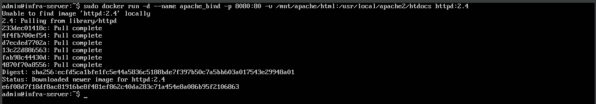

---

## 6. Verificación del contenedor en ejecución

Luego, se comprobo el estado del contenedor creado con el comando:

- docker ps

y despues, se accedió a la dirección de la pagina web con:

- curl http://localhost:8080

Perminitiendo visualizar correctamente la página HTML almacenada en /mnt/apache/html, demostrando que Apache está sirviendo contenido directamente desde el RAID.

**Evidencias:**
- *Figura 12.* Estado del contenedor. – `estado_contenedor.png`
  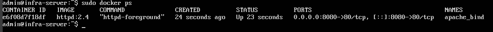
- *Figura 13.* Visualizacion de la pagina HTML alamacenada en apache. – `visualiacion_pagina_web.png`
  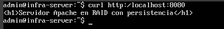

## Conclusion

La implementación del contenedor Apache con Docker utilizando un bind mount hacia el RAID 1 de Apache demuestra la correcta integración de las tres capas de la infraestructura:

- Capa física: RAID 1 para redundancia y disponibilidad.

- Capa lógica: LVM para gestión flexible de volúmenes.

- Capa de virtualización ligera: Docker, para encapsular el servicio en un contenedor independiente.

El resultado es un sistema resiliente, modular y persistente, capaz de mantener la integridad de los datos ante fallos físicos y de ofrecer despliegue rápido y seguro de servicios web.