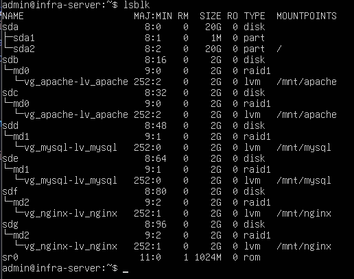
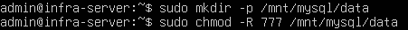
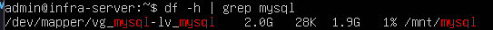
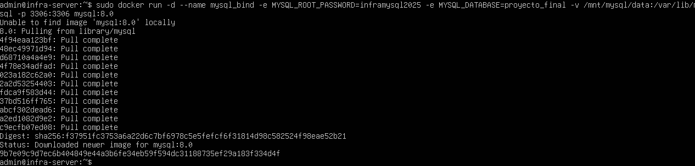
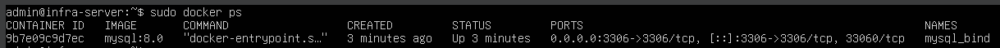
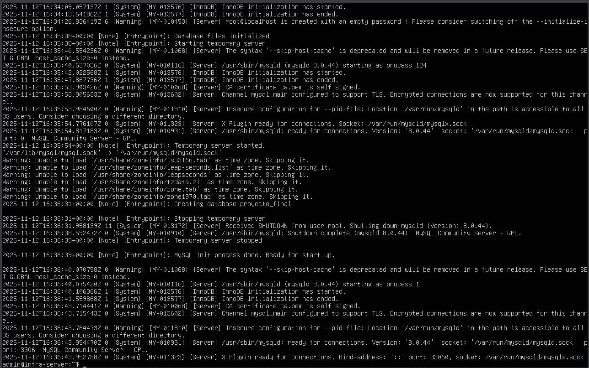

# Bitácora N°6 — Implementación del servicio MySQL con Docker y Bind Mount

## 1. Objetivo

Desplegar un contenedor con el servicio **MySQL** utilizando Docker, configurando **persistencia de datos mediante un bind mount** enlazado al RAID 1 dedicado al servicio de base de datos.  
Este procedimiento asegura que toda la información almacenada en MySQL quede protegida dentro del sistema redundante de discos, manteniendo coherencia y disponibilidad ante posibles fallos físicos.

---

## 2. Verificación del entorno de almacenamiento

Previo a la creación del contenedor, se verificó la existencia del directorio asignado al servicio de MySQL.  
El volumen se encuentra montado sobre el RAID `/dev/md1`, correspondiente a la capa de almacenamiento configurada en la infraestructura base.

Se comprobaron las rutas con:

- lsblk

Confirmando que el RAID 1 correspondiente (/dev/md1) y el LVM están operativos y listos para ser utilizados como punto de montaje para el contenedor.

Dentro de la ruta /mnt/mysql, se creó un directorio que funcionará como raíz de la base de datos y dado que esta ruta pertenece al volumen lógico sobre el RAID 1 de MySQL (/dev/md1), cualquier archivo que se almacene allí contará con redundancia automática y persistencia física, los comandos utilizados fueron

- sudo mkdir -p /mnt/mysql/data
- sudo chmod -R 777 /mnt/mysql/data

Tambien se le otorgo permisos 777, para garatizar que Docker pueda escribir directamente dentro del almacenamiento redundante.

y se verifico el punto de montaje:

- df -h | grep mysql

confirmando que /mnt/mysql está correctamente montado y operativo sobre la infraestructura RAID + LVM.

**Evidencias:**
- *Figura 1* Comprobacion RAID. – `comprobacion_RAID_mysql.png`
    
- *Figura 2* Creacion de directorio y asignacion de permisos. – `directorio_y_permisos_mysql.png`
    
- *Figura 3* Verificacion punto de montaje. – `verificacion_punto_montaje_mysql.png`
    

---

## 3. Creación del contenedor MySQL con persistencia

Para desplegar el servicio MySQL en Docker se utilizó la imagen oficial mysql:8.0.
La característica más importante en este caso es la persistencia de los datos, lograda al montar el directorio físico /mnt/mysql/data dentro del contenedor en la ruta /var/lib/mysql, donde MySQL almacena sus bases de datos.

El comando ejecutado fue:

- sudo docker run -d --name mysql_bind -e MYSQL_ROOT_PASSWORD=inframysql2025 -e MYSQL_DATABASE=proyecto_final -v /mnt/mysql/data:/var/lib/mysql -p 3306:3306 mysql:8.0

Donde: 
- *docker run* **Crea y ejecuta un nuevo contenedor.**
- *-d* **Ejecuta el contenedor en segundo plano (modo detached).**
- *--name mysql_bind* **Asigna un nombre identificador al contenedor.**
- *-e MYSQL_ROOT_PASSWORD=inframysql2025* **Establece la contraseña del usuario root del contenedor.**
- *-e MYSQL_DATABASE=proyecto_final* **Establece el nombre de la base de datos a utilizar.**
- *-v /mnt/mysql/data:/var/lib/mysql* **Establece un bind mount entre el RAID local y el directorio interno donde MySQL guarda sus archivos de datos.**
- *-p 3306:3306* **Expone el puerto 3306 del contenedor en el mismo puerto del host, permitiendo conexiones externas.**
- *mysql:8.0* **Especifica la Imagen oficial de MySQL versión 8.0 desde Docker Hub.**

**Evidencia:**
- *Figura 4* Creacion contenedor. – `creacion_contenedor_mysql.png`
    

---

## 4. Verificación del contenedor en ejecución

Luego, se comprobo el estado del contenedor creado con el comando:

- docker ps

También se revisaron los registros de inicialización:

- docker logs mysql_bind

Esto confirma que el contenedor está operativo y la base de datos se ha inicializado correctamente dentro del volumen persistente.

**Evidencia:**
- *Figura 5* Verificacion estado contenedor. – `estado_contenedor_mysql.png`
    
- *Figura 6* Verificacion logs inicializacion. – `logs_inicializacion_mysql.png`
    

## Conclusion
La implementación del contenedor MySQL 8.0 con persistencia mediante bind mount sobre el RAID 1 configurado demuestra una infraestructura robusta y eficiente.
El uso combinado de Docker + RAID + LVM garantiza que los datos sean:

- Persistentes: sobreviven a reinicios y eliminaciones del contenedor.

- Redundantes: replicados automáticamente en ambos discos del RAID.

- Escalables: ampliables sin afectar el servicio gracias a LVM.

De esta forma, se logra un entorno de base de datos altamente confiable, con separación de capas y facilidad de mantenimiento.

