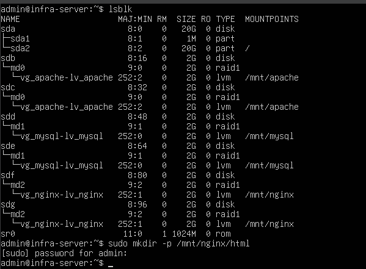
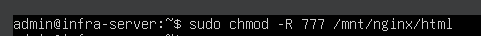
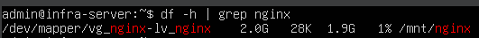
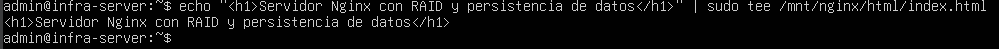
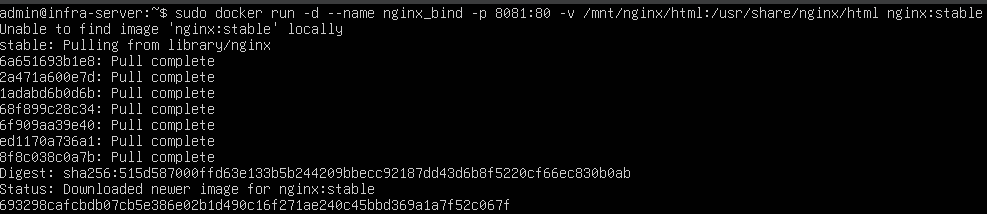
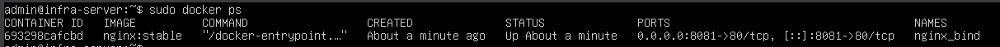
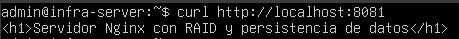

# Bitácora N°7 — Implementación del servicio Nginx con Docker y Bind Mount

## 1. Objetivo 

El objetivo de esta etapa fue desplegar un contenedor que ejecute el servicio Nginx utilizando Docker, garantizando la persistencia de los archivos web mediante un bind mount asociado al volumen lógico alojado sobre el RAID 1 previamente configurado para este servicio.
Esta integración permite que cualquier archivo servido por Nginx se almacene de manera permanente en un entorno redundante, seguro y resiliente. 

---

## 2. Verificación del entorno de almacenamiento

El RAID 1 correspondiente al servicio Nginx se encuentra configurado en el dispositivo `/dev/md2` y montado en el directorio `/mnt/nginx`, cualquier archivo que se almacene allí contará con redundancia automática y persistencia física.  

Antes de crear el contenedor, se comprobo la ruta de montaje y se creo el directorio que contendrá los archivos web servidos por Nginx, los comandos utilizados fueron:

- lsblk
- sudo mkdir -p /mnt/mysql/data
- sudo chmod -R 777 /mnt/mysql/data

Tambien se le otorgo permisos 777, para garatizar que Docker pueda escribir directamente dentro del almacenamiento redundante.

y se verifico el punto de montaje:

- df -h | grep nginx

La verificación confirmó que /mnt/nginx está correctamente montado sobre el RAID 1 con soporte LVM, asegurando que cualquier contenido servido por Nginx será almacenado físicamente en discos redundantes.

**Evidencias:**
- *Figura 1* Comprobacion RAID y creacion del directorio. – `RAID_y_directorio.png`
    
- *Figura 2* Asignacion de permisos al directorio. – `verificacion_punto_montaje_nginx.png`
    
- *Figura 3* Verificacion punto de montaje. – `verificacion_punto_montaje_nginx.png`
    

---

## 3. Creación del contenido web de prueba

Antes de desplegar el contenedor, se creó un archivo HTML de prueba que servirá para verificar la correcta conexión del contenedor al RAID.

Se utilizó el comando tee para generar el archivo con permisos administrativos:

- echo "< h1 >Servidor Nginx con RAID y persistencia de datos< /h1 >" | sudo tee /mnt/nginx/html/index.html

El resultado fue el archivo /mnt/nginx/html/index.html, que contiene un mensaje identificativo del servicio.

**Evidencia:**
- *Figura 4* Creacion pagina html simple. – `creacion_index.html`
    

---

## 4. Creación del contenedor Nginx con persistencia

Con el entorno preparado, se procedió a crear y ejecutar el contenedor de Nginx, utilizando la imagen oficial nginx:stable.

El comando empleado fue el siguiente:

- sudo docker run -d --name nginx_bind -p 8081:80 -v /mnt/nginx/html:/usr/share/nginx/html nginx:stable

Donde:
- *docker run* **Crea y ejecuta un nuevo contenedor.**
- *-d* **Ejecuta el contenedor en segundo plano (modo detached).**
- *--name nginx_bind* **Asigna un nombre identificador al contenedor.**
- *-p 8081:80* **Asocia el puerto 8081 del host con el 80 del contenedor, permitiendo acceso vía navegador.**
- *-v /mnt/nginx/html:/usr/share/nginx/html* **Define un bind mount: enlaza el directorio físico del host (RAID 1) con el directorio interno donde Nginx aloja su contenido web.**
- *nginx:stable* **Especifica la imagen oficial de Nginx versión stable.**

**Evidencia:**
- *Figura 5* Creacion contenedor. – `creacion_contenedor_nginx.png`
    

---

## 5. Verificación del contenedor en ejecución

Luego, se comprobo el estado del contenedor creado con el comando:

- docker ps

y despues, se accedió a la dirección de la pagina web con:

- curl http://localhost:8081

Perminitiendo visualizar correctamente la página HTML almacenada en /mnt/nginx/html, demostrando que Nginx está sirviendo contenido directamente desde el RAID

**Evidencias:**
- *Figura 6* Estado del contenedor. – `estado_contenedor.png`
    
- *Figura 7* Visualizacion de la pagina HTML alamacenada en nginx. – `visualiacion_pagina_web.png`
    

## Conclusion
La implementación del servicio Nginx con Docker empleando un bind mount sobre el RAID 1 dedicado demuestra la integración efectiva de las tres capas de la infraestructura:

-RAID 1: garantiza redundancia de los archivos web.

-LVM: proporciona escalabilidad en la capacidad de almacenamiento.

-Docker: facilita el despliegue y administración del servicio con aislamiento y portabilidad.