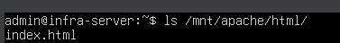
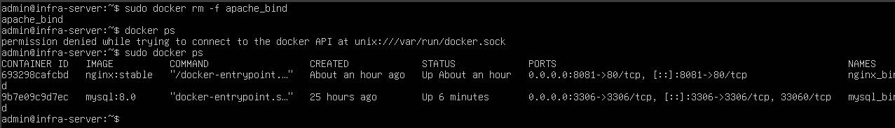
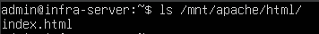
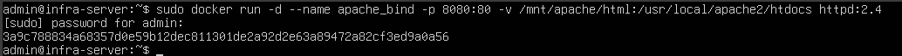
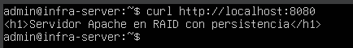
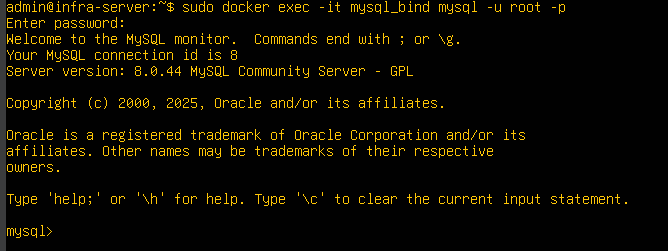
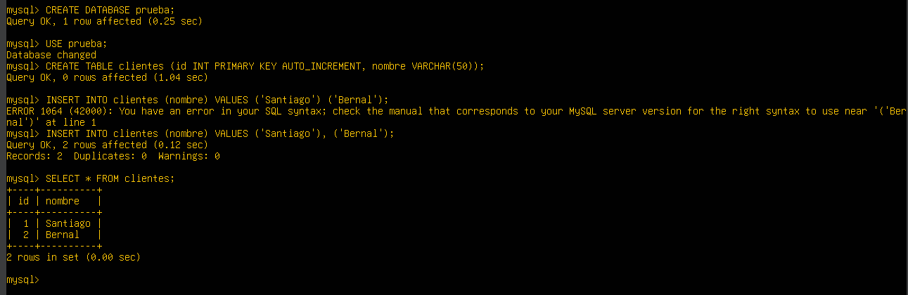

# Bitácora N°7 — Pruebas de persistencia de contenedores Docker (Apache, MySQL y Nginx)

# 1. Objetivo

Validar que los servicios desplegados en Docker (Apache, MySQL y Nginx) mantienen persistencia de datos gracias al uso de bind mounts asociados a los volúmenes configurados sobre la infraestructura RAID 1 + LVM.
Estas pruebas buscan demostrar que los datos permanecen intactos incluso si los contenedores se eliminan o se reconstruyen, verificando así el correcto funcionamiento de la arquitectura de almacenamiento y virtualización.

---

## 2. Entorno de prueba

Cada servicio utiliza su propio RAID, volumen lógico y directorio de montaje:

**Apache** `/dev/md0` `/mnt/apache/html` `/usr/local/apache2/htdocs`

**MySQL** `/dev/md1` `/mnt/mysql/data`  `/var/lib/mysql`

**Nginx** `/dev/md2` `/mnt/nginx/html` `/usr/share/nginx/html`

Estos directorios fueron configurados como bind mounts, lo que permite que los datos se escriban directamente en el almacenamiento físico redundante.

---

## 3. Prueba de persistencia — Apache

Se inició la prueba confirmando que el archivo HTML usado por Apache se encontraba correctamente almacenado en el RAID.  
Para ello, se listó el contenido del directorio:

- ls /mnt/apache/html

*Figura 1* - comprobacion existencia del archivo HTML persistente. – `extistencia_archivo_index.png`
     

La evidencia muestra claramente que el archivo index.html existe y contiene el mensaje configurado en pruebas previas.

Antes de eliminar el contenedor, se confirmó que Apache estaba sirviendo correctamente el contenido mediante:

- http://localhost:8080

La respuesta fue el HTML alojado en el RAID, demostrando que el contenedor estaba trabajando sobre los datos del host, se obtuvo como respuesta.

- **Servidor Apache en RAID con persistencia de datos**

*Figura 2* - comprobacion visualizacion del archivo HTML persistente en el navegador - `visualizacion_pagina_web.png`
    

Luego, para comprobar la persistencia, se eliminó completamente el contenedor::

- docker rm -f apache_bind

*Figura 3* - eliminacion del contenedor - `eliminacion_contenedor.png`
    

Se listó nuevamente el contenido del volumen::

- ls /mnt/apache/html

El archivo continuaba existiendo exactamente igual que antes de eliminar el contenedor, demostrando que el almacenamiento no depende de Docker, sino del RAID.

*Figura 4* - comprobacion persistencia - `verificacion_contenido_volumen.png`
    

Por ultimo, el contenedor fue recreado apuntando nuevamente al mismo bind mount::

- docker run -d --name apache_bind -p 8080:80 -v /mnt/apache/html:/usr/local/apache2/htdocs httpd:2.4

*Figura 5* - creacion de nuevo del contenedor - `contenedor_recreado.png`
    

Se accedió nuevamente al navegador.

*Figura 6* revisualizacion del archivo HTML persistente en el navegador - `revisualizacion_pagina_web.png`
    

El contenido era el mismo que existía antes de eliminar el contenedor, validando completamente la persistencia.

--- 

## 4. Prueba de persistencia — MySQL

Primero, se ingresó al contenedor MySQL con el comando:

- docker exec -it mysql_bind mysql -u root -p

*Figura 7* - ingreso al contenedor MySQL - `ingreso_contenedor_mysql.png`
    

Y se creo una base de datos y tabla de prueba:

- CREATE DATABASE prueba;
- USE prueba;
- CREATE TABLE clientes (id INT PRIMARY KEY AUTO_INCREMENT, nombre VARCHAR(50));
- INSERT INTO clientes (nombre) VALUES ('Santiago'), ('Bernal');
- SELECT * FROM clientes;

*Figura 8* - creacion de base de datos y tabla de prueba - `creacion_base_datos.png`
    

Luego, el contenedor se eliminó completamente con:

- docker rm -f mysql_bind

y se verifico que los archivos de datos permanecen en el RAID:

- ls /mnt/mysql/data

*Figura 9* - eliminacion del contenedor - `eliminacion_contenedor_mysql.png`
    

Se volvió a crear el contenedor con el mismo volumen:

- docker run -d --name mysql_bind -e MYSQL_ROOT_PASSWORD=inframysql2025 -v /mnt/mysql/data:/var/lib/mysql -p 3306:3306 mysql:8.0

Donde:
- *docker run* **Crea y ejecuta un nuevo contenedor.**
- *-d* **Ejecuta el contenedor en segundo plano (modo detached).**
- *--name mysql_bind* **Asigna un nombre identificador al contenedor.**
- *-e MYSQL_ROOT_PASSWORD=inframysql2025* **Establece la contraseña del usuario root del contenedor.**
- *-v /mnt/mysql/data:/var/lib/mysql* **Establece un bind mount entre el RAID local y el directorio interno donde MySQL guarda sus archivos de datos.**
- *-p 3306:3306* **Expone el puerto 3306 del contenedor en el mismo puerto del host, permitiendo conexiones externas.**
- *mysql:8.0* **Especifica la Imagen oficial de MySQL versión 8.0 desde Docker Hub.**

*Figura 10* - creacion de nuevo del contenedor - `contenedor_mysql_recreado.png`
    

Luego, se volvio a ingresar a MySQL:

- docker exec -it mysql_bind mysql -u root -p
- SHOW DATABASES;

Finalmente, se comprobo que, los dos registros creados antes siguen existiendo, validando que MySQL también mantiene persistencia usando bind mounts.

*Figura 11* - comprobacion persistencia - `verificacion_persistencia_bd.png`
    

---

## 5. Prueba de persistencia — Nginx

Antes de eliminar el contenedor se revisó el contenido del RAID:

- ls /mnt/nginx/html

*Figura 12* - comprobacion existencia del archivo HTML persistente - `existencia_archivo_nginx.png`
    

Luego, se consulto el servicio activo::

- curl http://localhost:8081

Mostrando el mensaje:

- **Servidor Nginx con RAID y persistencia de datos**

*Figura 13* - Sitio Nginx activo con volumen RAID -  `sitio_nginx_activo.png`
    

Se eliminó el contenedor Nginx:

- docker rm -f nginx_bind

*Figura 14* - eliminacion del contenedor - `eliminacion_contenedor_nginx.png`
    

Se verificó el contenido del volumen:

- ls /mnt/nginx/html

y el archivo permaneció sin cambios. 

*Figura 15* - comprobacion persistencia - `verificacion_persistencia_nginx.png`
    

Se creó nuevamente el contenedor:

- docker run -d --name nginx_bind -p 8081:80 -v /mnt/nginx/html:/usr/share/nginx/html nginx:stable

Donde:
- *docker run* **Crea y ejecuta un nuevo contenedor.**
- *-d* **Ejecuta el contenedor en segundo plano (modo detached).**
- *--name nginx_bind* **Asigna un nombre identificador al contenedor.**
- *-p 8081:80* **Asocia el puerto 8081 del host con el 80 del contenedor, permitiendo acceso vía navegador.**
- *-v /mnt/nginx/html:/usr/share/nginx/html* **Define un bind mount: enlaza el directorio físico del host (RAID 1) con el directorio interno donde Nginx aloja su contenido web.**
- *nginx:stable* **Especifica la imagen oficial de Nginx versión stable.**  

*Figura 16* - creacion de nuevo del contenedor - `contenedor_nginx_recreado.png`
    

Finalmente, al acceder de nuevo al navegador, el sitio web seguía disponible con el mismo contenido original.

*Figura 17* Nginx mantiene datos tras recrear contenedor - `revisualizacion_pagina_web_nginx.png`
    

## Conclusion

Las pruebas realizadas demuestran que la infraestructura de almacenamiento configurada con RAID + LVM, combinada con Docker y bind mounts, ofrece una solución robusta, persistente y tolerante a fallos.

Cada contenedor puede eliminarse o reconstruirse sin pérdida de información, dado que los datos residen fuera de la capa de virtualización, en los volúmenes físicos del sistema.
Esto confirma el cumplimiento de los objetivos del proyecto en la fase de virtualización y persistencia.