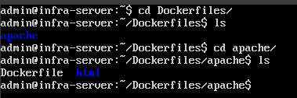
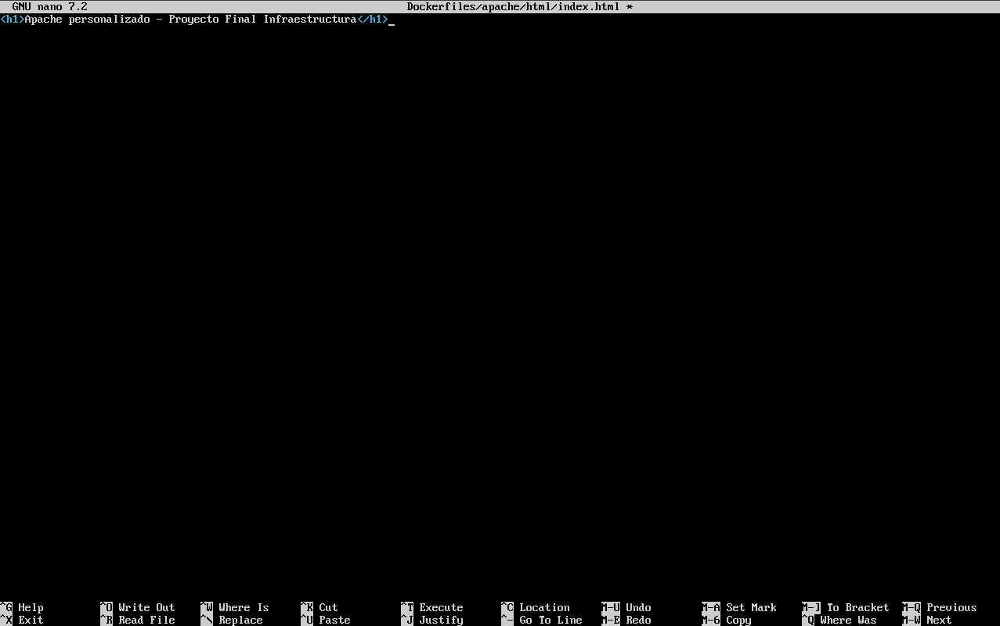
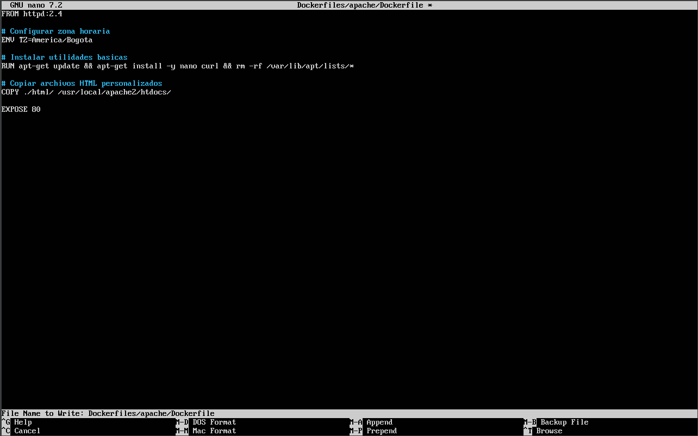
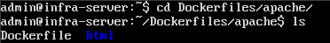
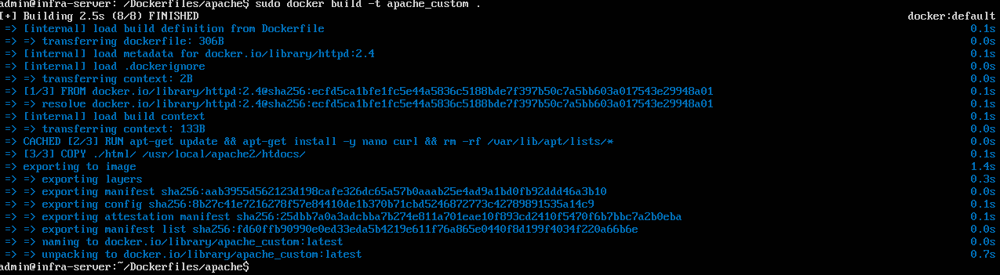
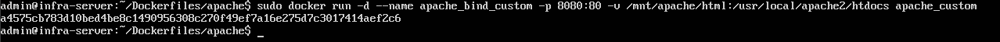
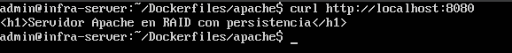

# Bitácora N°9 — Creación de la Imagen Personalizada para Apache con Dockerfile

## 1. Objetivo

Construir una imagen Docker personalizada para el servicio **Apache**, integrando contenido HTML propio y configuraciones básicas a través de un Dockerfile.  
Además, se documenta la creación de la estructura de directorios dentro de la máquina virtual para organizar correctamente los archivos del proyecto.

---

## 2. Creación del entorno en la máquina virtual

Antes de iniciar, se organizó una estructura de trabajo dentro del usuario local de la VM.  
Se creó un directorio base para el proyecto y un subdirectorio exclusivo para Apache:

- mkdir -p ~/ProyectoFinalInfra/Dockerfiles/apache/html

Luego se creó el archivo index.html que será incluido en la imagen personalizada:

- nano ~/ProyectoFinalInfra/Dockerfiles/apache/html/index.html

y se añadio el contenido simple del archivo:

- < h1 >Apache personalizado — Proyecto Final Infraestructura< /h1 >

**Evidencias:**
- *Figura 1.* Estructura de directorios creada. – `estructura_directorios.png`
  
- *Figura 2.* Contenido del archivo index.html. – `contenido_index_html.png`
    

## 3. Creación del Dockerfile 

Dentro de la carpeta de Apache se creó el Dockerfile:

- nano ~/ProyectoFinalInfra/Dockerfiles/apache/Dockerfile

Se añadio el contenido:

- FROM httpd:2.4

#### # Configurar zona horaria
- ENV TZ=America/Bogota

#### # Instalar utilidades básicas
RUN apt-get update && apt-get install -y nano curl && rm -rf /var/lib/apt/lists/*

#### # Copiar archivos HTML personalizados
COPY ./html/ /usr/local/apache2/htdocs/

EXPOSE 80

Donde:

- *FROM httpd:2.4* **Especifica la imagen base oficial de Apache versión 2.4.**
- *ENV TZ=America/Bogota* **Configura la zona horaria del contenedor.**
- *RUN apt-get update && apt-get install -y nano curl && rm -rf /var/lib/apt/lists/*** **Actualiza los repositorios e instala utilidades básicas como nano y curl, limpiando la caché después.**
- *COPY ./html/ /usr/local/apache2/htdocs/* **Copia el contenido del directorio html local al directorio de Apache dentro del contenedor.**
- *EXPOSE 80* **Indica que el contenedor escuchará en el puerto 80.**

**Evidencia:**
- *Figura 3.* Contenido del Dockerfile. – `contenido_dockerfile.png`
  

## 4. Construcción de la imagen Docker

Una vez creados los archivos, se construyó la imagen desde la carpeta apache:

- cd ~/ProyectoFinalInfra/Dockerfiles/apache
- sudo docker build -t apache_custom .

Docker procesó capa por capa hasta crear la imagen llamada apache_custom.

**Evidencias:**
- *Figura 4.* Proceso de construcción de la imagen. – `proceso_construccion_imagen.png`
  
- *Figura 5.* Imagen personalizada creada. – `imagen_creada.png`
    

## 5. Ejecución y prueba de la imagen personalizada

El contenedor se ejecutó con:

- sudo docker run -d --name apache_bind_custom -p 8080:80 -v /mnt/apache/html:/usr/local/apache2/htdocs apache_custom

Donde:
- *docker run -d* **Ejecuta el contenedor en segundo plano.**
- *--name apache_bind_custom* **Asigna un nombre al contenedor.**
- *-p 8080:80* **Mapea el puerto 80 del contenedor al puerto 8080 de la máquina host.**
- *-v /mnt/apache/html:/usr/local/apache2/htdocs* **Monta un volumen para persistencia de datos.**

y se verificó su funcionamiento accediendo a:

- curl http://localhost:8080

El contenido correspondió al archivo index.html incluido previamente.

**Evidencias:**
- *Figura 6.* Contenedor en ejecución. – `contenedor_ejecucion.png`
  
- *Figura 7.* Respuesta del contenedor Apache. – `respuesta_contenedor.png`
  

## Conclusión

La imagen personalizada para Apache quedó correctamente construida.
Se integraron archivos propios, configuraciones básicas y se demostró el funcionamiento real del Dockerfile dentro de la infraestructura organizada en la máquina virtual.