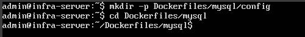
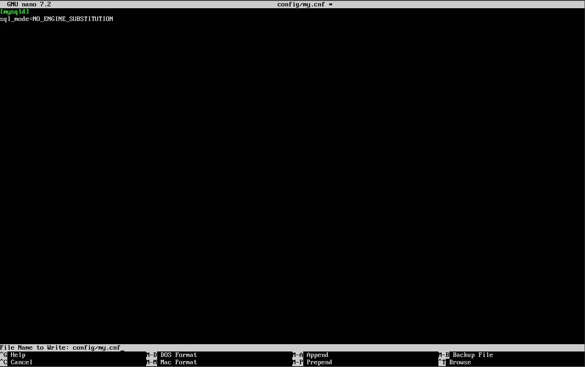
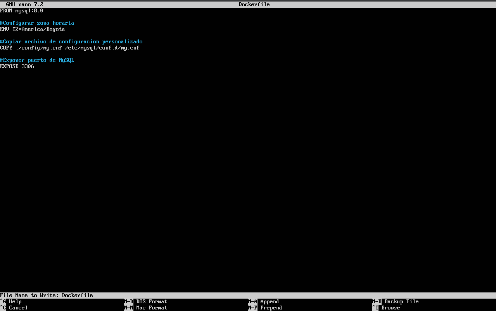
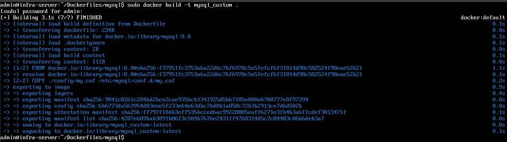
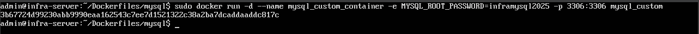
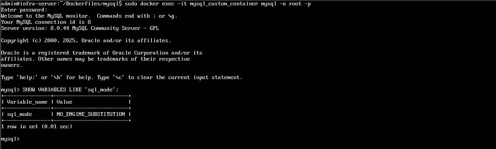

# Bitácora N°10 — Creacion de la Imagen Personalizada para MySQL con Dockerfile

## 1. Objetivo

Construir una imagen Docker personalizada que incorpore configuraciones básicas del motor para el servicio **MySQL**, configurándola para asegurar la persistencia de datos mediante el uso de un volumen montado en el directorio RAID `/mnt/mysql/data`.  

---

## 2. Creación del entorno en la máquina virtual

Antes de crear la imagen, se organizó un espacio dentro del servidor Ubuntu para almacenar el Dockerfile y los archivos asociados:

Se creó un subdirectorio exclusivo para MySQL:

- mkdir -p ~/Dockerfiles/mysql/config
- cd ~/Dockerfiles/mysql

**Evidencia:**
- *Figura 1.* Estructura de directorios creada. – `estructura_directorios_mysql.png`
  

## 3. Archivo de configuración my.cnf

Dentro de la carpeta config/ se creó un archivo de configuración básico para MySQL:

- nano config/my.cnf

Con el siguiente contenido:

- [mysqld]
- sql_mode=NO_ENGINE_SUBSTITUTION

La instrucción sql_mode=NO_ENGINE_SUBSTITUTION, le indica a MySQL que, si un motor de almacenamiento no está disponible, no intente reemplazarlo automáticamente por otro y el bloque [mysqld] indica que las configuraciones aplican al servidor MySQL.

**Evidencia:**
- *Figura 2.* Contenido del archivo my.cnf. – `contenido_my_cnf.png`
    

## 4. Creación del Dockerfile

En el directorio principal del servicio (dockerfiles/mysql/), se creó el archivo:

- nano Dockerfile

Con el siguiente contenido:

- FROM mysql:8.0

- #### # Configurar zona horaria
- ENV TZ=America/Bogota

- #### # Copiar archivo de configuración personalizado
- COPY ./config/my.cnf /etc/mysql/conf.d/my.cnf

- #### # Exponer puerto de MySQL
- EXPOSE 3306

Donde: 
- *FROM mysql:8.0* **Especifica la imagen base oficial de MySQL versión 8.0.**
- *ENV TZ=America/Bogota* **Configura la zona horaria del contenedor.**
- *COPY ./config/my.cnf /etc/mysql/conf.d/my.cnf* **Copia el archivo de configuración personalizado al directorio de configuración de MySQL dentro del contenedor.**
- *EXPOSE 3306* **Indica que el contenedor escuchará en el puerto 3306.**

**Evidencia:**
- *Figura 3.* Contenido del Dockerfile. – `contenido_dockerfile_mysql.png`
  

## 5. Construcción de la imagen Docker

Una vez creados los archivos, se construyó la imagen desde la carpeta mysql:

- cd ~/Dockerfiles/mysql
- sudo docker build -t mysql_custom .

Este comando genera una nueva imagen local con el nombre mysql_custom, basada en la configuración definida.

**Evidencia:**
- *Figura 4.* Proceso de construcción de la imagen. – `proceso_construccion_imagen_mysql.png`
     

## 6. Ejecución del contenedor desde la imagen personalizada

Se creó un contenedor utilizando la imagen recién construida:

sudo docker run -d --name mysql_custom_container -e MYSQL_ROOT_PASSWORD=inframysql2025 -p 3306:3306 mysql_custom

Donde:
- *docker run -d* **Ejecuta el contenedor en segundo plano.**
- *--name mysql_custom_container* **Asigna un nombre al contenedor.** 
- *-e MYSQL_ROOT_PASSWORD=inframysql2025* **Establece la contraseña del usuario root de MySQL.**
- *-p 3306:3306* **Mapea el puerto 3306 del contenedor al puerto 3306 de la máquina host.**
- *mysql_custom* **Especifica la imagen desde la cual se crea el contenedor.**

Luego, para verificar que MySQL funciona correctamente:

- docker exec -it mysql_custom_container mysql -u root -p

Se ingresó la contraseña establecida y se ejecutó el comando:

- SHOW VARIABLES LIKE 'sql_mode';

Esto confirmó que la configuración personalizada se aplicó correctamente.

**Evidencias:**
- *Figura 5.* Contenedor en ejecución. – `contenedor_ejecucion_mysql.png`
  
- *Figura 6.* Verificación de configuración personalizada. – `verificacion_configuracion_mysql.png`
  

## Conclusión

La creación de una imagen personalizada de MySQL permitió añadir configuraciones simples, herramientas internas y parámetros de inicialización.
La integración con el bind mount vinculado al RAID asegura persistencia total: las bases de datos no dependen del contenedor, sino del servidor físico.
La ejecución, mantenimiento y reconstrucción del servicio son ahora seguras y reproducibles.