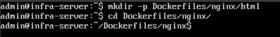
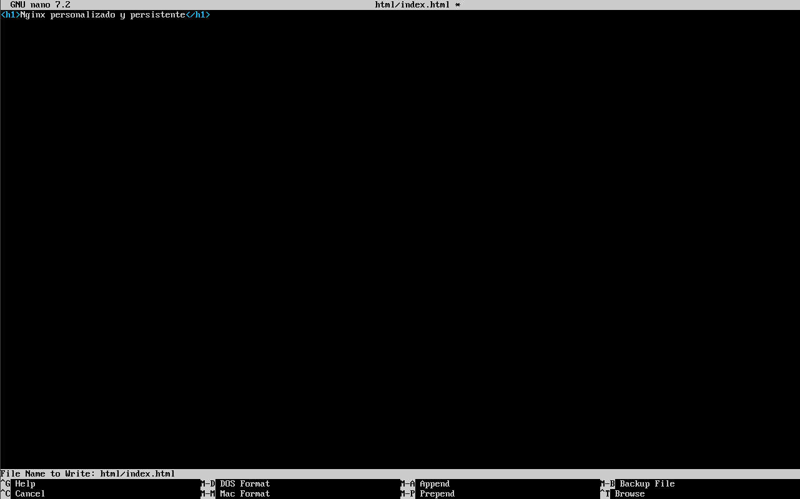
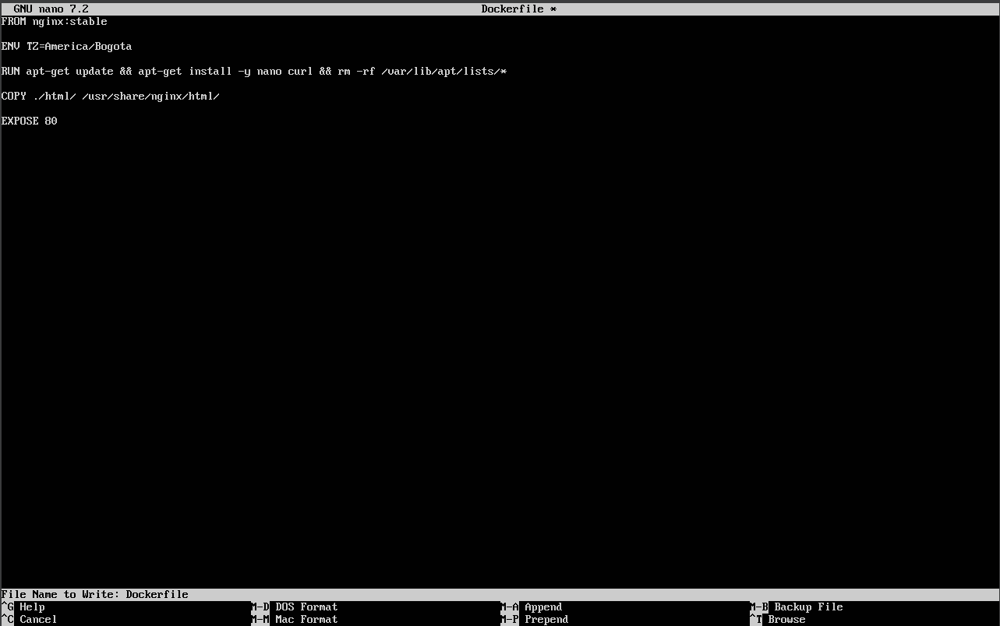
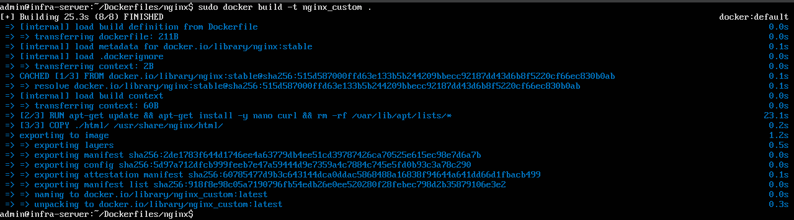
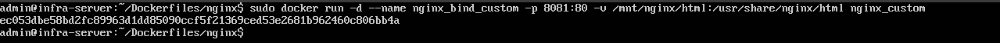
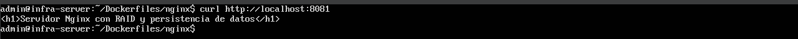

# Bitácora N°11 — Creacion de la Imagen Personalizada para Nginx con Dockerfile

## 1. Objetivo

El objetivo es desarrollar la creación de una imagen personalizada de Nginx, modificando la imagen oficial nginx:stable, agregando utilidades internas y preparando contenido web propio.
El propósito final es ejecutar este Nginx con persistencia total mediante un bind mount a /mnt/nginx/html, el cual se encuentra almacenado en un RAID 1.

## 2. Preparación del entorno

Antes de crear la imagen, se creó la estructura de directorios necesaria en la máquina virtual Ubuntu para almacenar el Dockerfile y los archivos asociados:

- mkdir -p ~/Dockerfiles/nginx/html
- cd ~/Dockerfiles/nginx

**Evidencia:**
- *Figura 1.* Estructura de directorios creada. – `estructura_directorios_nginx.png`
  

## 3. Creación del archivo web de prueba

Dentro del directorio html/, se creó un archivo HTML simple que será servido por el contenedor Nginx:

- nano html/index.html

Con el siguiente contenido:

"< h1 >Nginx personalizado y persistente< /h1 >"

Este archivo permitirá verificar que el contenedor realmente sirve contenido desde el RAID y no desde su sistema interno.

**Evidencia:** 
- *Figura 2.* Archivo HTML creado. – `index_html_nginx.png`
  

## 4. Creación del Dockerfile

En el directorio principal del servicio (Dockerfiles/nginx/), se creó el archivo:

- nano Dockerfile

Con el siguiente contenido:

- FROM nginx:stable

- ENV TZ=America/Bogota

- RUN apt-get update && apt-get install -y nano curl && rm -rf /var/lib/apt/lists/*

- COPY ./html/ /usr/share/nginx/html/

- EXPOSE 80

Donde:

- *FROM nginx:stable* **Especifica la imagen base oficial de Nginx en su versión estable.**
- *ENV TZ=America/Bogota* **Configura la zona horaria del contenedor.**
- *RUN apt-get update && apt-get install -y nano curl && rm -rf /var/lib/apt/lists/** **Actualiza los repositorios e instala las utilidades nano y curl dentro del contenedor, luego limpia la caché de apt para reducir el tamaño de la imagen.**
- *COPY ./html/ /usr/share/nginx/html/* **Copia el contenido del directorio html/ del host al directorio predeterminado de Nginx donde se alojan los archivos web.**
- *EXPOSE 80* **Indica que el contenedor escuchará en el puerto 80 para conexiones HTTP.**  

**Evidencia:**
- *Figura 3.* Contenido del Dockerfile. – `dockerfile_nginx.png`
  

## 5. Construcción de la imagen personalizada

Con el Dockerfile y los archivos preparados, se procedió a construir la imagen personalizada ejecutando el siguiente comando desde el directorio Dockerfiles/nginx/:

- sudo docker build -t nginx_custom .

Donde:
- *docker build* **Comando para construir una imagen Docker a partir de un Dockerfile.**
- *-t nginx_custom* **Asigna el nombre nginx_custom a la nueva imagen creada.**
- *.* **Indica que el contexto de construcción es el directorio actual.**

**Evidencia:**
- *Figura 4.* Proceso de construcción de la imagen. – `construccion_imagen_nginx.png`
  

## 6. Ejecución del contenedor desde la imagen personalizada

Se creó un contenedor utilizando la imagen recién construida, con persistencia total mediante un bind mount al RAID:

- sudo docker run -d --name nginx_bind_custom -p 8081:80 -v /mnt/nginx/html:/usr/share/nginx/html nginx_custom

Donde:
- *docker run -d* **Ejecuta el contenedor en segundo plano.**
- *--name nginx_bind_custom* **Asigna un nombre al contenedor.**
- *-p 8081:80* **Mapea el puerto 80 del contenedor al puerto 8081 de la máquina host.**
- *-v /mnt/nginx/html:/usr/share/nginx/html* **Define un bind mount: enlaza el directorio físico del host (RAID 1) con el directorio interno donde Nginx aloja su contenido web.**
- *nginx_custom* **Especifica la imagen desde la cual se crea el contenedor.**

**Evidencia:**
- *Figura 5.* Creación del contenedor. – `creacion_contenedor_nginx.png`
  

## 7. Verificación del contenedor en ejecución

Luego, se comprobó que el contenido del contenedor se sirve correctamente desde el RAID accediendo a través del navegador web a la dirección:

- curl http://localhost:8081

Mostrando la página HTML personalizada creada anteriormente.

**Evidencia:**
- *Figura 6.* Verificación del contenido servido. – `verificacion_contenido_nginx.png`
  

## Conclusión
La imagen personalizada de Nginx demuestra cómo modificar un servicio básico, añadir utilidades internas y preparar contenido web propio.
La integración con RAID y LVM mediante bind mounts garantiza estabilidad y persistencia en el almacenamiento, permitiendo que el servicio pueda recrearse sin perder información.
El resultado es un servicio web moderno, seguro y totalmente compatible con los principios de infraestructura del proyecto.

